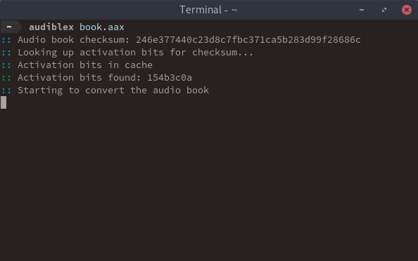

# Audiblex



Audible aax audio book to M4A, M4B and MP3 converter.

It works by extracting the audio book checksum, looking up it's activation bits in a rainbow table and converting the to the specified format.

## Platform
The script is only tested on Linux x64.

## Requirements
* Python 3
* [ffmpeg](https://ffmpeg.org/) for converting

## Install
```shell
sudo ./install.sh
```

## Usage
```
positional arguments:
  file                  The aax file to convert

optional arguments:
  -h, --help            show this help message and exit
  -t TYPE, --type TYPE  The destination filetype M4B, M4A or MP3
  -a ACTIVATION, --activation ACTIVATION
                        Define the activation bits to use
  -s, --single          Convert to a single file
  -l, --lookup          Lookup the activation bits in the rainbow table
  -c, --clear           Clear the activation bits cache
```

## Examples
```shell
# Convert book to M4A and auto lookup activation bits
audiblex BOOK.aax

# Just lookup the activation bits without converting
audiblex BOOK.aax -l

# Use 'a1b2c3d4' as activation bits and convert
audiblex BOOK.aax -a a1b2c3d4

# Convert to single file of type 'MP3'
audiblex BOOK.aax -s -t MP3
```

## Thanks to
[r15ch13](https://github.com/r15ch13/audible-converter) for the rainbow table and [jostyee](https://github.com/jostyee/AAXtoM4B) for the file converters.

## Future
- Could be nice to not be depended on the file converter binaries and just use ffmpeg directly. 
- Could also be nice to not need the rainbow table binaries and convert tables to something python could read.
